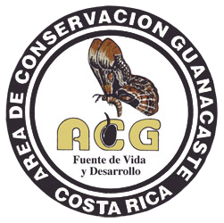

<div align="center">
	<a href="https://www.acguanacaste.ac.cr/">
		
	</a>
	<br>
	<sub>San Emilio is located within Área de Conservación Guanacaste.</sub>
</div>

# San Emilio Forest Dynamics Plot

The **San Emilio Forest Dynamics Plot (SEFDP)** is a long-term tropical dry-forest research site in Sector Santa Rosa of [Área de Conservación Guanacaste](https://www.acguanacaste.ac.cr/) (ACG), Guanacaste Province, Costa Rica. Four mapped woody-stem surveys spanning 1976–2021 provide a record of forest composition, structure, and change across approximately 45 years.

This repository contains the public website, research presentation, field-photo archive, and structured supporting content for the plot.

**[Explore the live SEFDP website](https://benquist.github.io/SanEmilioForestDynamicsPlot.github.io/)** · **[View the ForestGEO profile](https://forestgeo.si.edu/sites/san-emilio)**

## Plot at a glance

| Attribute | Description |
| --- | --- |
| Location | Sector Santa Rosa, Área de Conservación Guanacaste, Costa Rica |
| Coordinates | 10.839379° N, 85.613550° W |
| Ecosystem | Seasonally dry tropical forest |
| Survey record | Four mapped woody-stem surveys, 1976–2021 |
| Recent census area | 15.64 ha reported by ForestGEO |
| Nominal dimensions | 240 × 680 m, treated as approximate bounds rather than an area calculation |
| Topographic settings | Ridge, slope, mesa-top, and valley-bottom habitats |
| Network | ForestGEO site |

## Ecological setting

San Emilio has a pronounced seasonal climate, with a wet season generally extending from June through December and a dry season from January through May. Annual rainfall is approximately 1,500 mm. The plot spans several topographic positions and contains forest with differing land-use histories and inferred ages.

The [ForestGEO site profile](https://forestgeo.si.edu/sites/san-emilio) describes roughly one-third of the forest as approximately 100-year-old secondary forest on land formerly used for cattle grazing and banana cultivation, another third as likely 120–170 years old, and the remainder as intermediate in age. These are inferred relative age classes, not exact establishment dates.

## Census history

The survey record combines historical mapped censuses with a recent ForestGEO-protocol census. Changes in sampled area, minimum stem diameter, and field procedures are important when comparing surveys.

| Survey | Leadership | Reported design |
| --- | --- | --- |
| 1976–77 | George Stevens and Stephen Hubbell | Mapped and measured woody stems, including lianas, at least 3 cm DBH across a reported 14.4 ha |
| 1995–96 | Brian J. Enquist | Recensus using the 3 cm DBH threshold and a broadly comparable mapped-survey design; historical computer-card data were digitized and quality checked |
| 2006–07 | Nathan Swenson | Third mapped survey using the 3 cm DBH threshold; mapping and tagging were not identical across all survey years |
| 2019–21 | Adam Chmurzynski | ForestGEO-protocol census of 15.64 ha, mapping woody stems, including lianas, at least 1 cm DBH |

Archived presentation material shows that the 1976 survey recorded species and DBH at mapped stem locations within a 20 × 20 m grid. Not every recorded tree was tagged, and most tagged trees were larger than 10 cm DBH. The same material documents a later triangle-and-tape mapping method for the 2006–07 and 2019–21 surveys; the mapping method used in 1995–96 requires confirmation. Historical limits on individual tagging mean that growth, mortality, recruitment, and survival analyses require census-specific stem-linkage metadata rather than an assumption that every mapped stem has a persistent identifier.

Only the 2019–21 survey used the ForestGEO protocol. Earlier surveys used an overlapping historical design, a larger minimum-diameter threshold, and a smaller reported area. The historical description places DBH measurement at 1.3 m, but this repository does not contain a complete cross-census field protocol defining irregular-stem and liana measurement rules, live/dead inclusion, or treatment of multistem individuals. These details must be confirmed from census metadata before analysis. Comparisons across surveys should harmonize footprint, minimum diameter, stem identity, measurement rules, and taxonomy.

## Interpreting reported totals

ForestGEO profile metadata report approximately 34,000 "trees" and 176 species. Slide 42 of the project presentation separately reports 36,465 stems at least 1 cm DBH and 145 species for the recent survey as results from Chmurzynski et al. in preparation. These unpublished totals should not be treated as interchangeable until their counting units, inclusion of lianas and multiple stems, treatment of morphospecies and unidentified records, synonym handling, and taxonomic authority and version are reconciled.

ForestGEO also reports a census area of 15.64 ha and nominal dimensions of 240 × 680 m. A complete rectangle with those dimensions would cover 16.32 ha, so this repository presents the dimensions as approximate bounds rather than deriving plot area from them.

## Research scope

The plot's principal research value is its approximately 45-year record of spatially explicit woody-stem observations across a heterogeneous, regenerating tropical dry forest. Its strongest applications involve long-term compositional and structural change when analyses explicitly harmonize survey footprint, diameter threshold, stem identity, measurement protocols, and taxonomy.

Research using San Emilio observations has examined:

- long-term floristic and functional composition;
- population dynamics, species richness, and functional diversity;
- forest succession and land-use history;
- drought exposure and canopy phenology;
- plant allometry and life-history variation;
- remote-sensing measures of forest structure and seasonal canopy behavior; and
- functional and phylogenetic community ecology.

The cited studies are observational and cover different survey periods, variables, and spatial supports. Reported associations should not be interpreted as isolating a single causal driver, and site-specific findings should not be generalized to other tropical dry forests without independent evaluation.

## Data access and stewardship

Compilation and collection of SEFDP data are coordinated and provided by **PI Brian J. Enquist** and **Co-PIs Nathan Swenson and Adam Chmurzynski**. ACG identifies the protected-area setting, ForestGEO identifies the site's network and recent census-protocol affiliation, and the SEFDP PI team coordinates project data access. These roles should not be interpreted as a claim that ACG or ForestGEO manages this repository or endorses its contents.

The ForestGEO plot profile is public, and the full SEFDP dataset is available by request. Researchers are welcome to contact the PI team with their name, affiliation, project title, a short project summary, research interests, and the SEFDP data of interest. The team will follow up to coordinate access and confirm which census tables, stem coordinates, diameter records, taxonomic crosswalks, protocol metadata, quality-control documentation, file formats, version dates, and known comparability limitations are available. Before the full dataset is shared, data users complete a project data use agreement; the signed agreement, rather than this README, defines the applicable terms.

**[Request SEFDP data access](mailto:benquist@arizona.edu?subject=SEFDP%20data%20access%20inquiry%20-%20%5Bproject%20title%5D&body=Name%3A%0AAffiliation%3A%0AProject%20title%3A%0A%0AShort%20project%20summary%3A%0A%0AResearch%20interests%3A%0A%0ASEFDP%20data%20of%20interest%2C%20if%20known%3A)**

## Selected sources

- [ForestGEO San Emilio site profile](https://forestgeo.si.edu/sites/san-emilio), accessed 31 July 2026.
- [Enquist & Enquist (2011), *Long-term change within a Neotropical forest: assessing differential functional and floristic responses to disturbance and drought*](https://doi.org/10.1111/j.1365-2486.2010.02326.x), *Global Change Biology* 17(3): 1408–1424.
- [Swenson et al. (2020), *Long-term shifts in the functional composition and diversity of a tropical dry forest: a 30-yr study*](https://doi.org/10.1002/ecm.1408), *Ecological Monographs* 90(3): e01408.
- [Huang et al. (2021), *Remotely sensed assessment of increasing chronic and episodic drought effects on a Costa Rican tropical dry forest*](https://doi.org/10.1002/ecs2.3824), *Ecosphere* 12(11): e03824.

The website's [publications dataset](data/publications.json) provides additional references associated with San Emilio and its broader ecological context.

## Repository contents

- `index.html` — Public site with plot overview, census history, presentation, findings, publications, field archive, and data-access information.
- `assets/css/styles.css` — Responsive visual system and presentation components.
- `assets/js/main.js` — Navigation, slide viewer, filters, and archive interactions.
- `assets/img/` — Project-owned field photographs, maps, logos, and figure assets.
- `assets/presentation/` — Original research presentation and 46 optimized slide images.
- `data/slides.json` — Extracted slide titles, transcripts, chapters, and image paths.
- `data/publications.json` — Structured publication metadata.
- `data/findings.json` — Findings summaries with census-period tags and figure references.
- `scripts/export_presentation.py` — Repeatable PDF-to-WebP slide renderer and PowerPoint text extractor.

## Local development

Serve the repository through a local HTTP server so JSON-backed sections load correctly:

```bash
python3 -m http.server 8088
```

Then open `http://127.0.0.1:8088/`. The site is deployed from the repository's `main` branch through GitHub Pages.

## Presentation workflow

The website uses static WebP slide renders for fast viewing and retains the original PowerPoint as a download. The workflow requires a manual PowerPoint-to-PDF export plus Python with `pypdfium2` and Pillow. After exporting an updated presentation to `/tmp/SanEmilio_Presentation_ForestGeo5.pdf`, regenerate the web assets with:

```bash
python3 scripts/export_presentation.py \
	--pptx assets/presentation/SanEmilio_Presentation_ForestGeo5.pptx \
	--pdf /tmp/SanEmilio_Presentation_ForestGeo5.pdf \
	--output assets/presentation
```

The script checks that PowerPoint and PDF slide counts agree, renders full slides and thumbnails, and updates `data/slides.json`.
